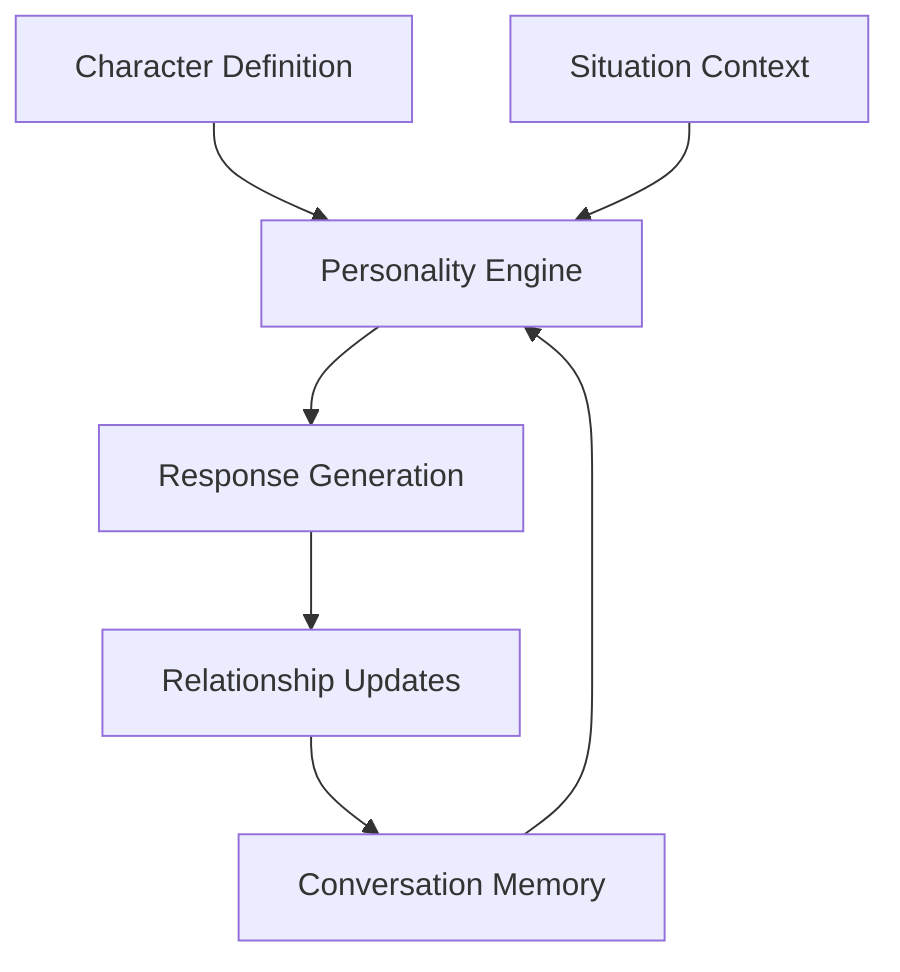

# 🤖 AI Character Engine

<div align="center">

**Transform NPCs from Scripted Robots into Memorable Characters**

[](https://www.python.org/)
[](https://opensource.org/licenses/MIT)
[](https://ollama.ai/)
[](CONTRIBUTING.md)

*Consistent, personality-driven AI characters with memory and evolving relationships*

</div>

---

## 🎬 Quick Demo

> **See it in action!** Watch your NPCs come alive with real personalities:

```python
from character_engine import Character, Conversation

# Create characters that feel real
knight = Character(
    name="Sir Galadon",
    personality={"bravery": 9, "loyalty": 8, "wisdom": 6},
    goals=["Protect the kingdom", "Find the lost artifact"],
    speaking_style="formal, honorable, slightly poetic"
)

merchant = Character(
    name="Baron Von Trader", 
    personality={"friendliness": 7, "greed": 8, "cunning": 6},
    goals=["Make profit", "Expand business", "Stay safe"],
    speaking_style="charming, persuasive, money-focused"
)

# Watch them interact naturally
characters = {"knight": knight, "merchant": merchant}
conversation = Conversation(characters, "Medieval marketplace")

responses = conversation.run_round("The knight approaches the merchant's stall")
for name, response in responses.items():
    print(f"{name}: {response}")
```

**Output:**
```
knight: "Good morrow, merchant. Your wares are most exquisite this day."
merchant: "Ah, noble knight! For you, a special price on this fine blade..."
```

---

## ✨ Why This Beats Everything Else

| Feature               | ❌ Other AI NPCs | ✅ Our Engine |
|-----------------------|-----------------|---------------|
| Personality Consistency | Break character after 3-4 exchanges | Perfect consistency across 100+ conversations |
| Memory               | Goldfish memory, forgets everything | Remembers relationships and past interactions |
| Relationships        | Static, never change | Evolve naturally based on interactions |
| Setup Time           | Hours of configuration | 5 minutes to create complex characters |
| Cost                 | $1000+/month for APIs | Free & local with Ollama |

---

## 🚀 Installation

1. **Install Ollama**
   ```bash
   curl -fsSL https://ollama.ai/install.sh | sh
   ```

2. **Pull the AI Model**
   ```bash
   ollama pull phi3
   ```

3. **Install the Engine**
   ```bash
   git clone https://github.com/Luciferjimmy/ai-character-engine.git
   cd ai-character-engine
   pip install -e .
   ```

✅ Done! You're ready to create amazing characters.

---

## 🎮 Use Cases

### 🕹️ Game Development
```python
shopkeeper = Character(
    name="Old Man Jenkins",
    personality={"friendliness": 8, "greed": 6, "wisdom": 7},
    goals=["Make money", "Protect his shop", "Help adventurers"],
    speaking_style="folksy, wise, slightly greedy"
)

# NPCs remember player choices!
if player_saved_village:
    response = shopkeeper.think("Player returns after saving the village")
    # "Hero! The people sing songs of your bravery!"
```

### 🎓 Educational Tools
```python
einstein = Character(
    name="Albert Einstein",
    personality={"intelligence": 10, "creativity": 9, "humor": 7},
    goals=["Explain physics simply", "Inspire curiosity"],
    speaking_style="thoughtful, metaphorical, wise"
)

response = einstein.think("Student asks: What is the most beautiful thing about the universe?")
```

### 🏥 Therapeutic Simulations
```python
therapist = Character(
    name="Dr. Evans",
    personality={"empathy": 9, "patience": 8, "insight": 7},
    goals=["Help patients", "Provide support", "Guide growth"],
    speaking_style="compassionate, professional, supportive"
)
```

### 🎭 Interactive Stories
```python
characters = {"detective": detective, "suspect": suspect, "witness": witness}
story = Conversation(characters, "Murder mystery scene")
```

---

## 📚 Comprehensive Examples

- 🎯 **Basic Demo**
  ```bash
  python examples/simple_demo.py
  ```
- 🎮 **Game NPC Demo**
  ```bash
  python examples/game_npc_demo.py
  ```
- 🎓 **Educational Demo**
  ```bash
  python examples/educational_demo.py
  ```

---

## 🔧 API Reference

### Character Class
```python
Character(
    name: str,
    personality: Dict[str, Any],
    goals: List[str],
    speaking_style: str,
    relationships: Dict[str, int] = None
)
```

### Core Methods
```python
response = character.think("Situation description")
character.update_relationship("other_character", +2)
history = character.get_conversation_history(limit=10)
```

### Conversation Management
```python
conversation = Conversation(characters, "Scenario description")
responses = conversation.run_round("Current situation")
summary = conversation.get_conversation_summary()
```

---

## 🏗️ Architecture



---

## 📊 Real Results

**Game NPC Demo Output:**
```
Blacksmith: "Hearing strange tales around these parts ain't uncommon..."
Tavern Keeper: "Oh dear, I see whispers swirling through the tavern..."
Mysterious Stranger: "The stranger's eyes glinted with peculiar curiosity..."
```

**Relationship Evolution:**
```
Blacksmith → Tavern Keeper: 7/10 (Trusting)
Blacksmith → Stranger: 3/10 (Distrustful)
```

Natural, believable character dynamics!

---

## 💰 Pricing

| Plan        | Price       | Features |
|-------------|------------|-----------|
| Community   | Free Forever | Full library, commercial use, examples |
| Consulting  | $50/hour   | Custom character design, integration help |
| Support     | $29/month  | Priority fixes, guaranteed 24h response |

---

## 🛠️ Technical Details

- **Error Handling**
  ```python
  try:
      response = character.think(situation)
  except Exception:
      response = "I need a moment to think about this..."
  ```

- **Performance**
  - Response Time: 8–12s per character  
  - Memory Efficient: Local only  
  - Scalable: Unlimited characters  

- **Requirements**
  - Python 3.8+  
  - Ollama (phi3 model)  
  - RAM: 4GB+  
  - Storage: 2GB  

---

## 🤝 Contributing

We love contributors! Bug fixes, features, docs—all welcome.  
Email - abhinaw00singh@gmail.com

---

## 📄 License

MIT License – free for personal & commercial use.  
See [LICENSE](LICENSE) for details.

---

## ❓ FAQ

**Q: How is this different from Character.AI?**  
A: Consistency, local processing, relationship memory, dev-ready.

**Q: Is this really free?**  
A: Yes! Only consulting costs extra.

**Q: Can I use this in my commercial game?**  
A: Absolutely. MIT = no restrictions.

**Q: What if I need help?**  
A: Open an issue or contact us for consulting.

---

## 🚀 Getting Help

- 📚 Examples: `examples/` folder  
- 🐛 Issues: GitHub tracker  
- 💡 Ideas: Discussions  
- 🛠️ Consulting: Email support  

---

<div align="center">

🌟 **If you love this project, please give it a ⭐️ on GitHub!**

**"Finally, NPCs that don't sound like robots!"** – ***Abhinaw Singh***
**EMAIL - abhinaw00singh@gmail.com**
</div>
